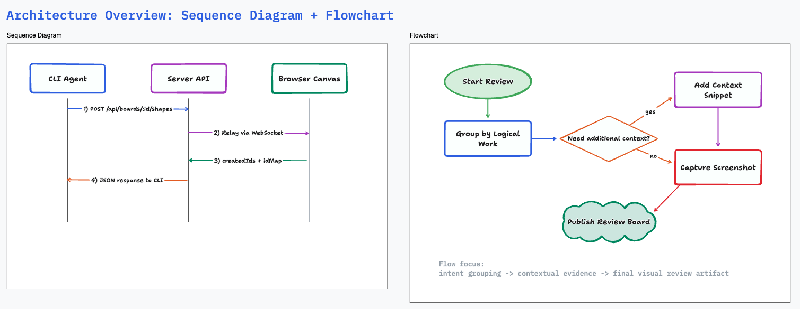
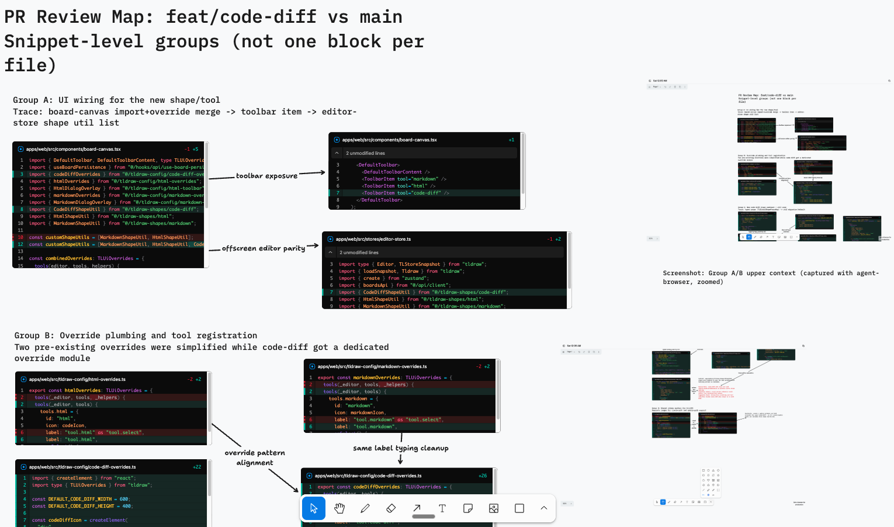

# Agent Canvas

A whiteboard CLI for coding agents like Claude Code, Codex, OpenCode, Amp, Gemini CLI, and more.

Use the `agent-canvas` CLI to orchestrate swarms of agents on the same board, compare multiple implementations of the same feature side-by-side, and keep each agent isolated with git worktrees while you pick the best approach.

## Main Use Cases

### 1) Architecture planning and feature iteration

Ask a coding agent to draw architecture and sequence diagrams so you can:

- plan architecture before implementation
- understand how an existing feature works end-to-end
- iterate on design and flow changes quickly



### 2) PR review with logical diff chunks and tested screenshots

Ask a coding agent to lay out PR changes as small, logical chunks of related diffs, then attach screenshots of the tested feature (for example with Playwright or agent-browser).



## Prerequisites

- [Bun](https://bun.sh/) (v1.0+)

## Quick Start (Linked CLI)

Build everything and link the `agent-canvas` command globally:

```bash
bun install
bun run build:link
```

This runs `build` (shared, server, web, cli), bundles the web app into the CLI, and links it via `bun link`.

### Add the Skill to Claude Code

The `skills/` directory contains a skill that teaches Claude Code how to use agent-canvas. Skills are directories with a `SKILL.md` inside.

Run this from the agent-canvas repo (where you just ran `build:link`):

```bash
CANVAS_DIR=$PWD

# Option 1: Symlink the skill directory (stays in sync with updates)
mkdir -p .claude/skills
ln -s "$CANVAS_DIR/skills" .claude/skills/agent-canvas

# Option 2: Copy the skill directory
cp -r "$CANVAS_DIR/skills" .claude/skills/agent-canvas
```

Now use the CLI:

```bash
# Start the server and open the browser
agent-canvas open

# Start without opening a browser (for agents)
agent-canvas open --headless

# Optional: pick a specific port (default is 3456; if occupied, CLI falls back to an open port)
agent-canvas open --port 3456

# Check status
agent-canvas status

# Create a board
agent-canvas boards create "My Board"

# List boards
agent-canvas boards list

# Draw shapes (board must be open in browser)
agent-canvas shapes create --board <board-id> --shapes '[
  {"type": "geo", "x": 100, "y": 100, "props": {"w": 200, "h": 100, "geo": "rectangle", "text": "Hello"}}
]'

# Read shapes back (compact YAML-like summaries by default)
agent-canvas shapes get --board <board-id>

# Read shapes as JSON (machine-readable)
agent-canvas shapes get --board <board-id> --json

# Read only specific shapes (minimal summaries)
agent-canvas shapes get --board <board-id> --ids '["shape:abc", "shape:def"]'

# Read full shape payloads as JSON (for file-based analysis)
agent-canvas shapes get --board <board-id> --full --json > shapes.json

# Stop the server
agent-canvas close
```

Default `shapes get` output is compact YAML-like text:
- It is optimized for lower token usage in agent contexts
- Use `--json` for machine-readable JSON output

Minimal-mode `shapes get` output is intentionally partial:
- It includes only `id`, `type`, and selected `props`
- Long values are truncated as `... (+N chars)`
- `code-diff` summaries include only `oldFile.name` / `newFile.name` (no file contents)
- `props._partial: true` means props are summarized, not complete
- Use `--full --json` when you need complete shape payloads

## Development Mode

Run the server and web app with hot reload:

```bash
bun install
bun run dev
```

This starts the Hono server (with `--watch`) and Vite dev server concurrently. The web app is available at the URL printed in the terminal.

`bun run dev` now auto-assigns non-conflicting server/web ports per worktree so you can run multiple worktrees in parallel.
In this mode, the web app also connects directly to the selected server WebSocket URL to avoid Vite ws proxy reset noise.

To run CLI commands against the dev server:

```bash
bun run cli -- boards list
bun run cli -- shapes get --board <board-id>
bun run cli -- shapes get --board <board-id> --json
bun run cli -- shapes get --board <board-id> --ids '["shape:abc"]'
bun run cli -- shapes get --board <board-id> --full --json > shapes.json
```

The CLI resolves the server for the current worktree automatically. To target a different running instance explicitly, set `AGENT_CANVAS_URL`.

## Project Structure

```
apps/
  cli/         CLI tool (Commander) — the `agent-canvas` command
  web/         React + TLDraw frontend (Vite)
packages/
  server/      Hono HTTP + WebSocket server
  shared/      Zod schemas and TypeScript types
skills/        Skill documentation for AI agents
```

## How It Works

Shape operations go through a WebSocket relay:

```
CLI → HTTP API → Server (validates with Zod) → WebSocket → Browser (TLDraw editor) → WebSocket response → HTTP response → CLI
```

The browser must have the board open for shape commands to work. The server acts as a relay between the CLI and the TLDraw editor running in the browser.

## Scripts

| Script                  | Description                                 |
| ----------------------- | ------------------------------------------- |
| `bun run dev`           | Start server + web with hot reload          |
| `bun run build`         | Build all packages                          |
| `bun run build:link`    | Build, bundle web into CLI, and `bun link`  |
| `bun run cli -- <args>` | Run CLI commands against dev server         |
| `bun run format`        | Format with Biome + Prettier                |
| `bun run clean`         | Remove all build artifacts and node_modules |
